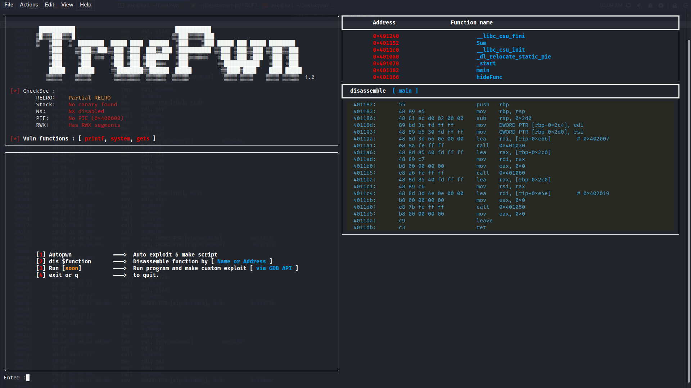
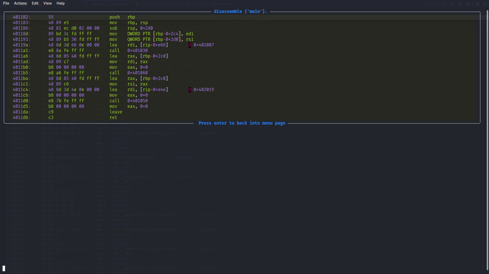

# TruePwn v1.0
  ># *features* :
  >1. Auto exploit & make python script [ _Texploit.py_ ].
  >2. Disassemble function by [ _Name or Address_ ].
  >3. Run program and make a custom exploit [ _via GDB API_ ]. _soon_
  >4. Easy to use _one click all done_. 🙂

> ### _requirements  : gdb, os: linux_
> _gdb :_ http://www.gdbtutorial.com/tutorial/how-install-gdb

## setup
```
git clone [url]
cd TruePwn
pip3 install -r requirements.txt
python3 TruePwn.py ./file.out
```
## source code for test `TruePwn.c`

```c
/*
    @ gcc version 10.2.1 
	gcc -fno-stack-protector -z execstack -no-pie TruePwn.c -o TruePwn.out
*/

#include <stdio.h>
int Sum(int x, int y){
	return x + y;
}
int hideFunc(){
	system("echo TruePwn!");
	return 1;
}
int main(int argc, char* argv[])
{
	char BUF[700];
	printf("Enter your name:\n");
	gets(BUF); 

	printf("Hello : %s", &BUF);	
}
```
# *Panel*

___
# *AutoPwn*

___

# *dis main

```
    ╔═══════════════════════════════╗                        		 ╔════════════════════════════════╗
    ║    Target vulnerability       ║                       		 ║   Target vulnerable functions  ║
    ╚═══════════════════════════════╝                       		 ╚════════════════════════════════╝

    ┌───────────────────────────────┐                   	 ┌─────────────────────────────────────────────────────┐
    │ Format string vulnerabilities │                   	 │   fprintf, fscanf, printf, scanf, sprintf, sscanf   │
    └───────────────────────────────┘                   	 └─────────────────────────────────────────────────────┘
  ┌──────────────────────────────────────┐           	 	┌─────────────────────────────────────────────────────────────┐
  │   Command execution vulnerabilities  │            		│ system, execl, execle, execlp, execv, execve, execvp, popen │
  └──────────────────────────────────────┘           		└─────────────────────────────────────────────────────────────┘
    ┌─────────────────────────────┐          		┌────────────────────────────────────────────────────────────────────────────────────────┐
    │  Buffer and memory errors   │          		│ calloc, malloc, realloc, fscanf,gets, scanf, sprintf, sscanf, strcat, strcpy,strncat,  │
    └─────────────────────────────┘          		│ strncmp, strncpy, memchr, memcmp, memcpy, memmove, memset, scanf, gets, fwscan, sscanf │
                                            		└────────────────────────────────────────────────────────────────────────────────────────┘
